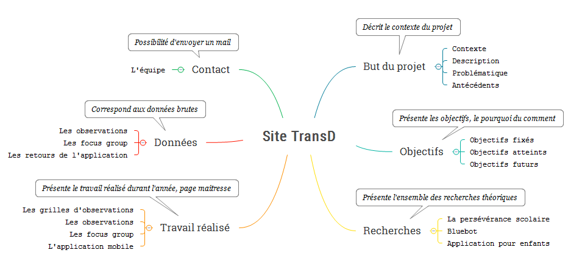

# SiteTransD

## Pour mettre à jour la mindmap :
* la modifier depuis le fichier xmind
* prendre une capture d'écran
* l'enregistrer sous le dossier image avec le nom "MindMap.png" (écraser l'image existante)
* push le tout

